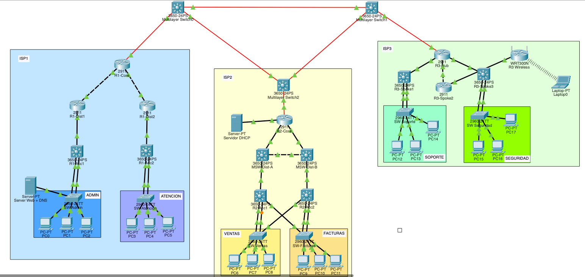
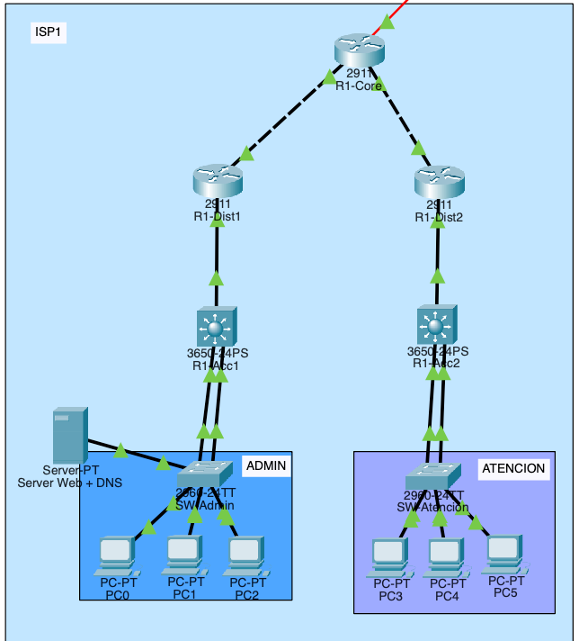
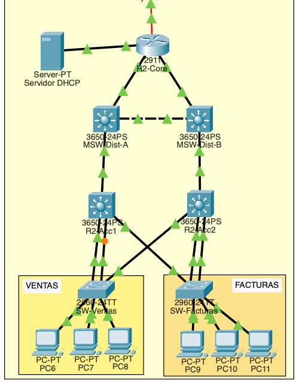
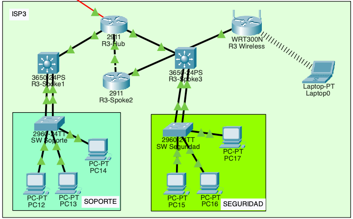
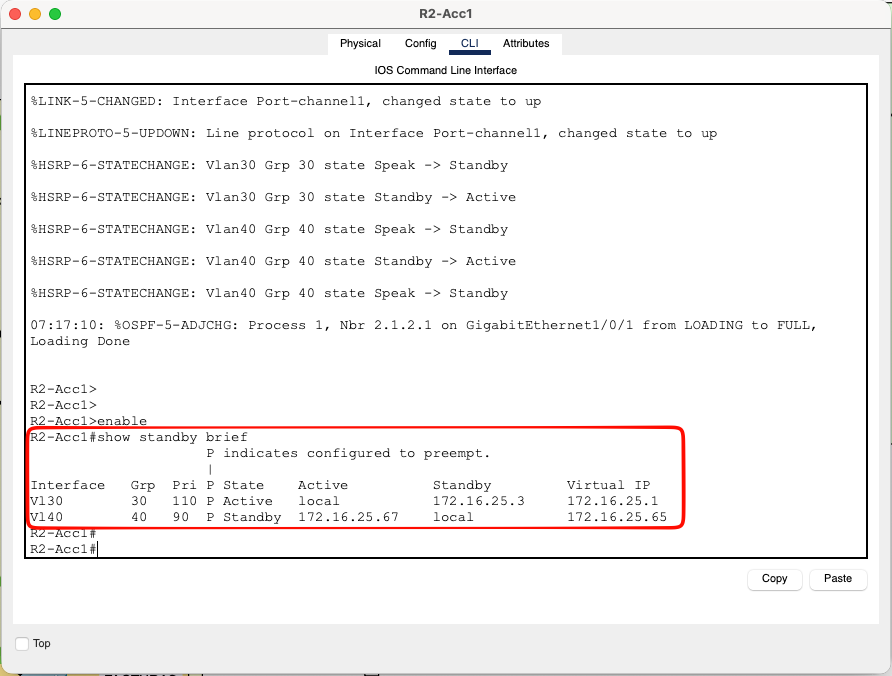
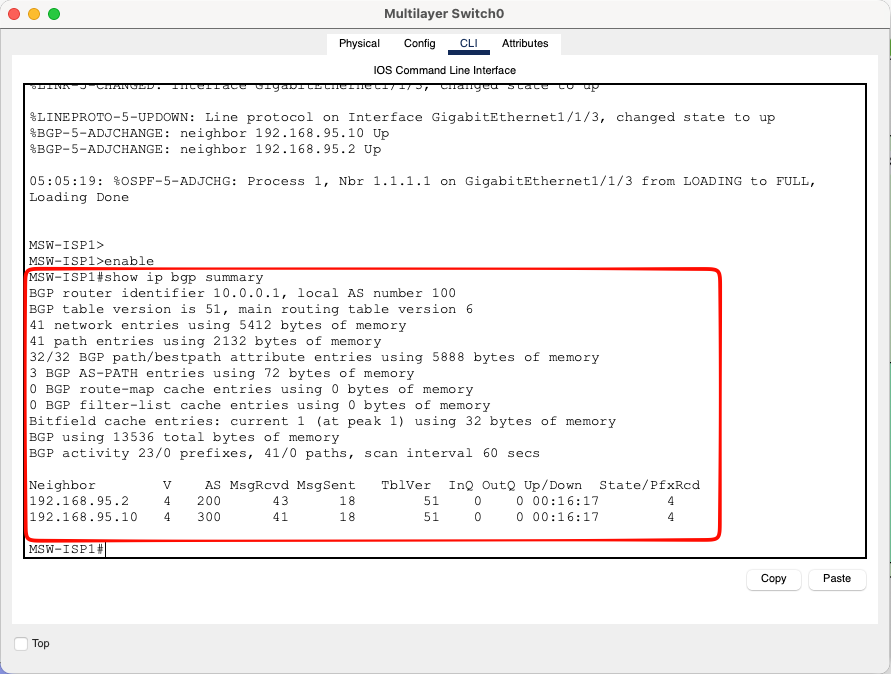
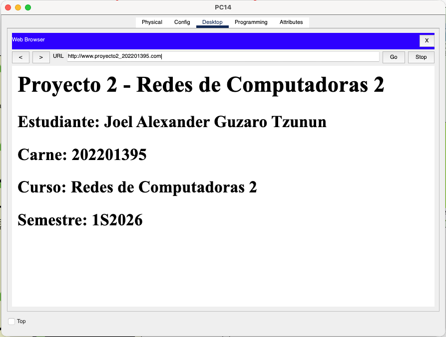
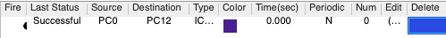

# Manual Técnico — Proyecto 2
## Telecom Uno, Redes Nacionales y Link Global: Conectando al País

---

**Universidad de San Carlos de Guatemala**  
**Facultad de Ingeniería — Ingeniería en Ciencias y Sistemas**  
**Curso:** Redes de Computadoras 2  
**Estudiante:** Joel Alexander Guzaro Tzunun  
**Carné:** 202201395  

---

## Índice

1. [Descripción General](#1-descripción-general)
2. [Topología de Red](#2-topología-de-red)
3. [Plan de Direccionamiento IP](#3-plan-de-direccionamiento-ip)
4. [ISP 1 — Telecom Uno](#4-isp-1--telecom-uno)
5. [ISP 2 — Redes Nacionales](#5-isp-2--redes-nacionales)
6. [ISP 3 — Link Global](#6-isp-3--link-global)
7. [Interconexión BGP](#7-interconexión-bgp)
8. [Servicios de Red](#8-servicios-de-red)
9. [Listas de Control de Acceso (ACLs)](#9-listas-de-control-de-acceso-acls)
10. [Validación y Pruebas](#10-validación-y-pruebas)

---

## 1. Descripción General

El proyecto consiste en el diseño e implementación de una infraestructura nacional de telecomunicaciones que interconecta tres proveedores de servicio de Internet (ISP) mediante el protocolo BGP. Cada ISP tiene una topología interna específica, protocolos de enrutamiento definidos y servicios críticos asignados.

### Resumen de ISPs

| ISP | Nombre | Topología | Protocolo | Servicio especial |
|---|---|---|---|---|
| ISP 1 | Telecom Uno | Árbol | OSPF | DNS + HTTP |
| ISP 2 | Redes Nacionales | Jerárquico | OSPF | DHCP central |
| ISP 3 | Link Global | Hub and Spoke | EIGRP | WiFi |

### Dispositivos utilizados

| Modelo | Función |
|---|---|
| Cisco 2911 | Routers Core, Distribución y Spokes |
| Cisco 3650-24PS | MSW BGP, Distribución ISP2, Acceso L3 |
| Cisco 2960-24TT | Switches de acceso L2 |
| WRT300N | Router inalámbrico ISP3 |
| Server-PT | Servidor Web+DNS y Servidor DHCP |

---

## 2. Topología de Red

### 2.1 Vista General



### 2.2 Triángulo BGP

Los tres ISPs se interconectan mediante tres Multilayer Switches 3650-24PS formando un triángulo de malla completa. Cada MSW actúa como Border Router BGP de su respectivo ISP.

| Enlace | Dispositivo A | Puerto | Dispositivo B | Puerto | Cable |
|---|---|---|---|---|---|
| BGP ISP1-ISP2 | MSW-ISP1 | G1/1/1 | MSW-ISP2 | G1/1/1 | Single-Mode Fiber |
| BGP ISP2-ISP3 | MSW-ISP2 | G1/1/2 | MSW-ISP3 | G1/1/1 | Single-Mode Fiber |
| BGP ISP1-ISP3 | MSW-ISP1 | G1/1/2 | MSW-ISP3 | G1/1/2 | Single-Mode Fiber |
| ISP1 backbone | MSW-ISP1 | G1/1/3 | R1-Core | G0/3/0 | Single-Mode Fiber |
| ISP2 backbone | MSW-ISP2 | G1/1/3 | R2-Core | G0/3/0 | Single-Mode Fiber |
| ISP3 backbone | MSW-ISP3 | G1/1/3 | R3-Hub | G0/3/0 | Single-Mode Fiber |

### 2.3 ISP 1 — Topología Árbol



### 2.4 ISP 2 — Modelo Jerárquico



### 2.5 ISP 3 — Hub and Spoke



---

## 3. Plan de Direccionamiento IP

### 3.1 Redes asignadas por carné (202201395)

| Recurso | Red | Notas |
|---|---|---|
| ISP 1 Telecom Uno | 172.16.15.0/24 | Último dígito carné = 5 |
| ISP 2 Redes Nacionales | 172.16.25.0/24 | Último dígito carné = 5 |
| ISP 3 Conexiones Futuras | 172.16.32.0/24 | Primer dígito carné = 2 |
| BGP Interconexión | 192.168.95.0/16 | Últimos 2 dígitos = 95 |

### 3.2 Direccionamiento BGP

| Enlace | Subred | IP MSW-ISP1 | IP MSW-ISP2 | IP MSW-ISP3 |
|---|---|---|---|---|
| MSW-ISP1 ↔ MSW-ISP2 | 192.168.95.0/30 | .1 | .2 | — |
| MSW-ISP2 ↔ MSW-ISP3 | 192.168.95.4/30 | — | .5 | .6 |
| MSW-ISP1 ↔ MSW-ISP3 | 192.168.95.8/30 | .9 | — | .10 |
| MSW-ISP1 ↔ R1-Core | 192.168.95.12/30 | .13 | — | — |
| MSW-ISP2 ↔ R2-Core | 192.168.95.16/30 | — | .17 | — |
| MSW-ISP3 ↔ R3-Hub | 192.168.95.20/30 | — | — | .21 |

### 3.3 Direccionamiento ISP 1 (172.16.15.0/24)

#### VLANs

| VLAN | Nombre | Subred | Gateway | Rango hosts |
|---|---|---|---|---|
| 10 | Administración | 172.16.15.0/26 | 172.16.15.1 | .4 — .62 |
| 20 | Atención al Cliente | 172.16.15.64/26 | 172.16.15.65 | .68 — .126 |

#### Enlace punto a punto

| Enlace | Subred | IP A | IP B |
|---|---|---|---|
| R1-Core ↔ R1-Dist1 | 172.16.15.128/30 | .129 (Core) | .130 (Dist1) |
| R1-Core ↔ R1-Dist2 | 172.16.15.132/30 | .133 (Core) | .134 (Dist2) |
| R1-Dist1 ↔ R1-Acc1 | 172.16.15.136/30 | .137 (Dist1) | .138 (Acc1) |
| R1-Dist2 ↔ R1-Acc2 | 172.16.15.140/30 | .141 (Dist2) | .142 (Acc2) |

#### Hosts ISP1

| Dispositivo | IP | Máscara | Gateway |
|---|---|---|---|
| PC0 | DHCP (~172.16.15.6) | 255.255.255.192 | 172.16.15.1 |
| PC1 | DHCP | 255.255.255.192 | 172.16.15.1 |
| PC2 | DHCP | 255.255.255.192 | 172.16.15.1 |
| PC3 | DHCP (~172.16.15.68) | 255.255.255.192 | 172.16.15.65 |
| PC4 | DHCP | 255.255.255.192 | 172.16.15.65 |
| PC5 | DHCP | 255.255.255.192 | 172.16.15.65 |
| Server-Web-DNS | 172.16.15.5 (estática) | 255.255.255.192 | 172.16.15.1 |

### 3.4 Direccionamiento ISP 2 (172.16.25.0/24)

#### VLANs con HSRP

| VLAN | Nombre | Subred | IP Virtual HSRP | IP R2-Acc1 | IP R2-Acc2 |
|---|---|---|---|---|---|
| 30 | Ventas | 172.16.25.0/26 | 172.16.25.1 (Active) | .2 | .3 |
| 40 | Facturación | 172.16.25.64/26 | 172.16.25.65 (Active) | .66 | .67 |

#### Enlace punto a punto

| Enlace | Subred | IP A | IP B |
|---|---|---|---|
| R2-Core ↔ MSW-Dist-A | 172.16.25.128/30 | .129 (Core) | .130 (Dist-A) |
| R2-Core ↔ MSW-Dist-B | 172.16.25.132/30 | .133 (Core) | .134 (Dist-B) |
| MSW-Dist-A ↔ MSW-Dist-B | 172.16.25.136/30 | .137 (A) | .138 (B) |
| MSW-Dist-A ↔ R2-Acc1 | 172.16.25.140/30 | .141 (A) | .142 (Acc1) |
| MSW-Dist-B ↔ R2-Acc2 | 172.16.25.152/30 | .153 (B) | .154 (Acc2) |
| R2-Core ↔ Server-DHCP | 172.16.25.156/30 | .157 (Core) | .158 (Server) |

#### Hosts ISP2

| Dispositivo | IP | Máscara | Gateway |
|---|---|---|---|
| PC6 | DHCP (~172.16.25.8) | 255.255.255.192 | 172.16.25.1 |
| PC7 | DHCP | 255.255.255.192 | 172.16.25.1 |
| PC8 | DHCP | 255.255.255.192 | 172.16.25.1 |
| PC9 | DHCP (~172.16.25.72) | 255.255.255.192 | 172.16.25.65 |
| PC10 | DHCP | 255.255.255.192 | 172.16.25.65 |
| PC11 | DHCP | 255.255.255.192 | 172.16.25.65 |
| Server-DHCP | 172.16.25.158 (estática) | 255.255.255.252 | 172.16.25.157 |

### 3.5 Direccionamiento ISP 3 (172.16.32.0/24)

#### VLANs

| VLAN | Nombre | Subred | Gateway | Rango hosts |
|---|---|---|---|---|
| 50 | Soporte | 172.16.32.0/26 | 172.16.32.1 | .5 — .62 |
| 60 | Seguridad | 172.16.32.64/26 | 172.16.32.65 | .69 — .126 |
| 70 | WLAN | 172.16.32.128/26 | 172.16.32.129 | .130 — .190 |

#### Enlace punto a punto

| Enlace | Subred | IP A | IP B |
|---|---|---|---|
| R3-Hub ↔ R3-Spoke1 | 172.16.32.192/30 | .193 (Hub) | .194 (Spoke1) |
| R3-Hub ↔ R3-Spoke2 | 172.16.32.196/30 | .197 (Hub) | .198 (Spoke2) |
| R3-Hub ↔ R3-Spoke3 | 172.16.32.200/30 | .201 (Hub) | .202 (Spoke3) |
| R3-Spoke2 ↔ R3-Wireless | 172.16.32.204/30 | .205 (Spoke2) | .206 (Wireless WAN) |

#### Hosts ISP3

| Dispositivo | IP | Máscara | Gateway |
|---|---|---|---|
| PC12 | DHCP (~172.16.32.5) | 255.255.255.192 | 172.16.32.1 |
| PC13 | DHCP | 255.255.255.192 | 172.16.32.1 |
| PC14 | DHCP | 255.255.255.192 | 172.16.32.1 |
| PC15 | DHCP (~172.16.32.69) | 255.255.255.192 | 172.16.32.65 |
| PC16 | DHCP | 255.255.255.192 | 172.16.32.65 |
| PC17 | DHCP | 255.255.255.192 | 172.16.32.65 |
| Laptop0 | DHCP (~172.16.32.130) | 255.255.255.192 | 172.16.32.129 |

---

## 4. ISP 1 — Telecom Uno

### 4.1 Descripción

Telecom Uno implementa una topología en árbol con OSPF como protocolo de enrutamiento interno. Es responsable de proveer servicios DNS y HTTP a toda la topología.

**Red base:** 172.16.15.0/24  
**Protocolo:** OSPF Area 0  
**Departamentos:** Administración (VLAN 10) y Atención al Cliente (VLAN 20)

### 4.2 Dispositivos y roles

| Dispositivo | Modelo | Rol | Router-ID OSPF |
|---|---|---|---|
| R1-Core | Cisco 2911 | Core — conecta al MSW-ISP1 | 1.1.1.1 |
| R1-Dist1 | Cisco 2911 | Distribución rama Administración | 1.1.2.1 |
| R1-Dist2 | Cisco 2911 | Distribución rama Atención | 1.1.3.1 |
| R1-Acc1 | Cisco 3650-24PS | Acceso L3 — gateway VLAN 10 | 1.1.4.1 |
| R1-Acc2 | Cisco 3650-24PS | Acceso L3 — gateway VLAN 20 | 1.1.5.1 |
| SW-Admin | Cisco 2960-24TT | Switch acceso VLAN 10 | — |
| SW-Atencion | Cisco 2960-24TT | Switch acceso VLAN 20 | — |
| Server-Web-DNS | Server-PT | DNS + HTTP | — |

### 4.3 Cableado ISP1

| Origen | Puerto | Destino | Puerto | Tipo |
|---|---|---|---|---|
| MSW-ISP1 | G1/1/3 | R1-Core | G0/3/0 | Single-Mode Fiber |
| R1-Core | G0/0 | R1-Dist1 | G0/0 | Cobre Cross-Over |
| R1-Core | G0/1 | R1-Dist2 | G0/0 | Cobre Cross-Over |
| R1-Dist1 | G0/1 | R1-Acc1 | G1/0/1 | Cobre Cross-Over |
| R1-Dist2 | G0/1 | R1-Acc2 | G1/0/1 | Cobre Cross-Over |
| R1-Acc1 | G1/0/2 | SW-Admin | G0/1 | Cobre Straight (LACP 1 E1) |
| R1-Acc1 | G1/0/3 | SW-Admin | G0/2 | Cobre Straight (LACP 1 E2) |
| R1-Acc2 | G1/0/2 | SW-Atencion | G0/1 | Cobre Straight (LACP 2 E1) |
| R1-Acc2 | G1/0/3 | SW-Atencion | G0/2 | Cobre Straight (LACP 2 E2) |
| SW-Admin | F0/1-3 | PC0-PC2 | F0 | Cobre Straight |
| SW-Admin | F0/4 | Server-Web-DNS | F0 | Cobre Straight |
| SW-Atencion | F0/1-3 | PC3-PC5 | F0 | Cobre Straight |

### 4.4 Configuración LACP ISP1

**LACP 1:** R1-Acc1 (G1/0/2, G1/0/3) ↔ SW-Admin (G0/1, G0/2)  
**LACP 2:** R1-Acc2 (G1/0/2, G1/0/3) ↔ SW-Atencion (G0/1, G0/2)

Los puertos físicos de los 3650 se configuran en modo trunk antes de agregar al channel-group para asegurar que el Port-channel sea L2 y pueda transportar las VLANs correctamente.

### 4.5 Configuración OSPF ISP1

OSPF Area 0 corre en todos los routers de ISP1. Las redes anunciadas incluyen los enlaces punto a punto y las subredes de las VLANs.

```
! R1-Core
router ospf 1
 router-id 1.1.1.1
 network 172.16.15.128 0.0.0.3 area 0
 network 172.16.15.132 0.0.0.3 area 0
 network 192.168.95.12 0.0.0.3 area 0

! R1-Dist1
router ospf 1
 router-id 1.1.2.1
 network 172.16.15.128 0.0.0.3 area 0
 network 172.16.15.136 0.0.0.3 area 0

! R1-Acc1
router ospf 1
 router-id 1.1.4.1
 network 172.16.15.136 0.0.0.3 area 0
 network 172.16.15.1 0.0.0.0 area 0
```

---

## 5. ISP 2 — Redes Nacionales

### 5.1 Descripción

Redes Nacionales implementa el modelo jerárquico de Cisco con tres capas: Core, Distribución y Acceso. Incluye redundancia de capa 3 mediante HSRP en la capa de distribución. Es el proveedor central de DHCP para toda la topología.

**Red base:** 172.16.25.0/24  
**Protocolo:** OSPF Area 0  
**Departamentos:** Ventas (VLAN 30) y Facturación (VLAN 40)

### 5.2 Dispositivos y roles

| Dispositivo | Modelo | Rol | Router-ID OSPF |
|---|---|---|---|
| R2-Core | Cisco 2911 | Core — conecta al MSW-ISP2 | 2.1.1.1 |
| MSW-Dist-A | Cisco 3650-24PS | Distribución — HSRP Active VLAN30, Standby VLAN40 | 2.1.2.1 |
| MSW-Dist-B | Cisco 3650-24PS | Distribución — HSRP Standby VLAN30, Active VLAN40 | 2.1.3.1 |
| R2-Acc1 | Cisco 3650-24PS | Acceso L3 — gateway VLAN 30/40 | 2.1.4.1 |
| R2-Acc2 | Cisco 3650-24PS | Acceso L3 — gateway VLAN 30/40 | 2.1.5.1 |
| SW-Ventas | Cisco 2960-24TT | Switch acceso VLAN 30 | — |
| SW-Facturas | Cisco 2960-24TT | Switch acceso VLAN 40 | — |
| Server-DHCP | Server-PT | DHCP centralizado para toda la topología | — |

### 5.3 Cableado ISP2

| Origen | Puerto | Destino | Puerto | Tipo |
|---|---|---|---|---|
| MSW-ISP2 | G1/1/3 | R2-Core | G0/3/0 | Single-Mode Fiber |
| R2-Core | G0/0 | MSW-Dist-A | G1/0/1 | Cobre Cross-Over |
| R2-Core | G0/1 | MSW-Dist-B | G1/0/1 | Cobre Cross-Over |
| R2-Core | G0/2 | Server-DHCP | F0 | Cobre Straight |
| MSW-Dist-A | G1/0/23 | MSW-Dist-B | G1/0/23 | Cobre Cross-Over (HSRP sync) |
| MSW-Dist-A | G1/0/2 | R2-Acc1 | G1/0/1 | Cobre Cross-Over |
| MSW-Dist-B | G1/0/2 | R2-Acc2 | G1/0/1 | Cobre Cross-Over |
| R2-Acc1 | G1/0/2 | SW-Ventas | G0/1 | Cobre Straight (LACP 1 E1) |
| R2-Acc1 | G1/0/3 | SW-Ventas | G0/2 | Cobre Straight (LACP 1 E2) |
| R2-Acc1 | G1/0/4 | SW-Facturas | F0/22 | Cobre Straight (cross-link HSRP) |
| R2-Acc2 | G1/0/2 | SW-Facturas | G0/1 | Cobre Straight (LACP 2 E1) |
| R2-Acc2 | G1/0/3 | SW-Facturas | G0/2 | Cobre Straight (LACP 2 E2) |
| R2-Acc2 | G1/0/4 | SW-Ventas | F0/22 | Cobre Straight (cross-link HSRP) |
| SW-Ventas | F0/1-3 | PC6-PC8 | F0 | Cobre Straight |
| SW-Facturas | F0/1-3 | PC9-PC11 | F0 | Cobre Straight |

### 5.4 Configuración HSRP

HSRP garantiza que si un router de acceso falla, el otro toma el rol de gateway automáticamente sin que los hosts noten interrupción. Los cables cruzados entre R2-Acc1/Acc2 y ambos switches permiten que HSRP funcione en el mismo segmento L2.

```
! R2-Acc1 — Active para VLAN30, Standby para VLAN40
interface Vlan30
 ip address 172.16.25.2 255.255.255.192
 standby 30 ip 172.16.25.1
 standby 30 priority 110
 standby 30 preempt

interface Vlan40
 ip address 172.16.25.66 255.255.255.192
 standby 40 ip 172.16.25.65
 standby 40 priority 90
 standby 40 preempt

! R2-Acc2 — Standby para VLAN30, Active para VLAN40
interface Vlan30
 ip address 172.16.25.3 255.255.255.192
 standby 30 ip 172.16.25.1
 standby 30 priority 90
 standby 30 preempt

interface Vlan40
 ip address 172.16.25.67 255.255.255.192
 standby 40 ip 172.16.25.65
 standby 40 priority 110
 standby 40 preempt
```



---

## 6. ISP 3 — Link Global

### 6.1 Descripción

Link Global implementa topología hub and spoke con EIGRP. El router central (Hub) conecta a todos los spokes. Incluye un router inalámbrico WRT300N para proveer servicio WiFi.

**Red base:** 172.16.32.0/24  
**Protocolo:** EIGRP AS 1  
**Departamentos:** Soporte (VLAN 50) y Seguridad (VLAN 60)

### 6.2 Dispositivos y roles

| Dispositivo | Modelo | Rol |
|---|---|---|
| R3-Hub | Cisco 2911 | HUB central — conecta al MSW-ISP3 |
| R3-Spoke1 | Cisco 3650-24PS | Spoke — gateway VLAN 50 Soporte |
| R3-Spoke2 | Cisco 2911 | Spoke — gateway hacia R3-Wireless |
| R3-Spoke3 | Cisco 3650-24PS | Spoke — gateway VLAN 60 Seguridad |
| R3-Wireless | WRT300N | Router inalámbrico — DHCP propio para WLAN |
| SW-Soporte | Cisco 2960-24TT | Switch acceso VLAN 50 |
| SW-Seguridad | Cisco 2960-24TT | Switch acceso VLAN 60 |

### 6.3 Cableado ISP3

| Origen | Puerto | Destino | Puerto | Tipo |
|---|---|---|---|---|
| MSW-ISP3 | G1/1/3 | R3-Hub | G0/3/0 | Single-Mode Fiber |
| R3-Hub | G0/0 | R3-Spoke1 | G1/0/1 | Cobre Cross-Over |
| R3-Hub | G0/1 | R3-Spoke2 | G0/0 | Cobre Cross-Over |
| R3-Hub | G0/2 | R3-Spoke3 | G1/0/1 | Cobre Cross-Over |
| R3-Spoke2 | G0/1 | R3-Wireless | WAN | Cobre Straight |
| R3-Spoke1 | G1/0/2 | SW-Soporte | G0/1 | Cobre Straight (LACP 1 E1) |
| R3-Spoke1 | G1/0/3 | SW-Soporte | G0/2 | Cobre Straight (LACP 1 E2) |
| R3-Spoke3 | G1/0/2 | SW-Seguridad | G0/1 | Cobre Straight (LACP 2 E1) |
| R3-Spoke3 | G1/0/3 | SW-Seguridad | G0/2 | Cobre Straight (LACP 2 E2) |
| SW-Soporte | F0/1-3 | PC12-PC14 | F0 | Cobre Straight |
| SW-Seguridad | F0/1-3 | PC15-PC17 | F0 | Cobre Straight |

### 6.4 Configuración EIGRP ISP3

```
! R3-Hub
router eigrp 1
 network 172.16.32.192 0.0.0.3
 network 172.16.32.196 0.0.0.3
 network 172.16.32.200 0.0.0.3
 network 192.168.95.20 0.0.0.3
 no auto-summary

! R3-Spoke1
router eigrp 1
 network 172.16.32.192 0.0.0.3
 network 172.16.32.0 0.0.0.63
 no auto-summary
```

### 6.5 Configuración Red Inalámbrica

| Parámetro | Valor |
|---|---|
| SSID | ISP3-WLAN |
| Autenticación | WPA2-PSK |
| Contraseña | proyecto2 |
| IP WAN | 172.16.32.206/30 |
| Gateway WAN | 172.16.32.205 (R3-Spoke2) |
| IP LAN | 172.16.32.129/26 |
| DHCP inicio | 172.16.32.130 |

---

## 7. Interconexión BGP

### 7.1 Configuración BGP

BGP interconecta los 3 ISPs mediante los MSW border routers. Cada ISP tiene un AS diferente.

| MSW | AS BGP | Router-ID |
|---|---|---|
| MSW-ISP1 | 100 | 10.0.0.1 |
| MSW-ISP2 | 200 | 10.0.0.2 |
| MSW-ISP3 | 300 | 10.0.0.3 |

```
! MSW-ISP1
router bgp 100
 bgp router-id 10.0.0.1
 neighbor 192.168.95.2 remote-as 200
 neighbor 192.168.95.2 next-hop-self
 neighbor 192.168.95.10 remote-as 300
 neighbor 192.168.95.10 next-hop-self
 network 172.16.15.0 mask 255.255.255.0
```

### 7.2 Redistribución de rutas

Para que los routers internos de cada ISP conozcan las redes de los otros ISPs, se redistribuyen las rutas entre BGP y los protocolos internos.

| MSW | Redistribuye |
|---|---|
| MSW-ISP1 | BGP → OSPF y OSPF → BGP |
| MSW-ISP2 | BGP → OSPF y OSPF → BGP |
| MSW-ISP3 | BGP → EIGRP y EIGRP → BGP |



---

## 8. Servicios de Red

### 8.1 Servidor Web + DNS (ISP1)

**Ubicación:** SW-Admin F0/4  
**IP:** 172.16.15.5/26  
**Gateway:** 172.16.15.1  

| Servicio | Detalle |
|---|---|
| DNS | Dominio: www.proyecto2_202201395.com → 172.16.15.5 |
| HTTP | Página estática con datos del estudiante |

El servidor DNS es accesible desde toda la topología gracias a la redistribución de rutas via BGP.



### 8.2 Servidor DHCP (ISP2)

**Ubicación:** R2-Core G0/2  
**IP:** 172.16.25.158/30  
**Gateway:** 172.16.25.157  

El servidor DHCP provee direccionamiento IP a todos los hosts de los 3 ISPs mediante `ip helper-address` en cada router de acceso.

#### Pools DHCP configurados

| Pool | Gateway | DNS | Start IP | Máscara |
|---|---|---|---|---|
| VLAN10-Admin | 172.16.15.1 | 172.16.15.5 | 172.16.15.4 | 255.255.255.192 |
| VLAN20-Atencion | 172.16.15.65 | 172.16.15.5 | 172.16.15.68 | 255.255.255.192 |
| VLAN30-Ventas | 172.16.25.1 | 172.16.15.5 | 172.16.25.8 | 255.255.255.192 |
| VLAN40-Facturacion | 172.16.25.65 | 172.16.15.5 | 172.16.25.72 | 255.255.255.192 |
| VLAN50-Soporte | 172.16.32.1 | 172.16.15.5 | 172.16.32.5 | 255.255.255.192 |
| VLAN60-Seguridad | 172.16.32.65 | 172.16.15.5 | 172.16.32.69 | 255.255.255.192 |

#### ip helper-address configurado en

| Router | Interface | helper-address |
|---|---|---|
| R1-Acc1 | Vlan10 | 172.16.25.158 |
| R1-Acc2 | Vlan20 | 172.16.25.158 |
| R2-Acc1 | Vlan30 | 172.16.25.158 |
| R2-Acc2 | Vlan40 | 172.16.25.158 |
| R3-Spoke1 | Vlan50 | 172.16.25.158 |
| R3-Spoke3 | Vlan60 | 172.16.25.158 |

---

## 9. Listas de Control de Acceso (ACLs)

### 9.1 Reglas de comunicación requeridas

| Departamento | Sale hacia | Recibe de |
|---|---|---|
| Seguridad | Todos | Ninguno |
| Soporte | Todos | Todos |
| Administración | Todos | Todos |
| Atención al Cliente | Solo Ventas | Solo Ventas |
| Facturación | Solo Ventas | Solo Ventas |
| Ventas | Facturación + Atención | Facturación + Atención |

### 9.2 ACL Seguridad

**Dispositivo:** R3-Spoke3  
**Interface:** Vlan60 outbound  

Permite que Seguridad inicie tráfico hacia cualquier destino, pero bloquea cualquier tráfico nuevo entrante. Permite `echo-reply` para que las respuestas de ping hacia Seguridad lleguen correctamente.

```
ip access-list extended ACL-SEGURIDAD-OUT
 permit icmp any 172.16.32.64 0.0.0.63 echo-reply
 deny ip any 172.16.32.64 0.0.0.63
 permit ip any any

interface Vlan60
 ip access-group ACL-SEGURIDAD-OUT out
```

### 9.3 ACL Atención al Cliente

**Dispositivo:** R1-Acc2  
**Interface:** Vlan20 inbound y outbound  

```
ip access-list extended ACL-ATENCION-IN
 permit ip 172.16.15.64 0.0.0.63 172.16.25.0 0.0.0.63
 deny ip 172.16.15.64 0.0.0.63 any
 permit ip any any

ip access-list extended ACL-ATENCION-OUT
 permit ip 172.16.25.0 0.0.0.63 172.16.15.64 0.0.0.63
 permit icmp any 172.16.15.64 0.0.0.63 echo-reply
 permit tcp any 172.16.15.64 0.0.0.63 established
 deny ip any 172.16.15.64 0.0.0.63
 permit ip any any

interface Vlan20
 ip access-group ACL-ATENCION-IN in
 ip access-group ACL-ATENCION-OUT out
```

### 9.4 ACL Facturación

**Dispositivo:** R2-Acc2  
**Interface:** Vlan40 inbound y outbound  

```
ip access-list extended ACL-FACTURACION-IN
 permit ip 172.16.25.64 0.0.0.63 172.16.25.0 0.0.0.63
 deny ip 172.16.25.64 0.0.0.63 any
 permit ip any any

ip access-list extended ACL-FACTURACION-OUT
 permit ip 172.16.25.0 0.0.0.63 172.16.25.64 0.0.0.63
 permit icmp any 172.16.25.64 0.0.0.63 echo-reply
 permit tcp any 172.16.25.64 0.0.0.63 established
 deny ip any 172.16.25.64 0.0.0.63
 permit ip any any

interface Vlan40
 ip access-group ACL-FACTURACION-IN in
 ip access-group ACL-FACTURACION-OUT out
```

### 9.5 ACL Ventas

**Dispositivo:** R2-Acc1  
**Interface:** Vlan30 inbound y outbound  

```
ip access-list extended ACL-VENTAS-IN
 permit ip 172.16.25.0 0.0.0.63 172.16.25.64 0.0.0.63
 permit ip 172.16.25.0 0.0.0.63 172.16.15.64 0.0.0.63
 deny ip 172.16.25.0 0.0.0.63 any
 permit ip any any

ip access-list extended ACL-VENTAS-OUT
 permit ip 172.16.25.64 0.0.0.63 172.16.25.0 0.0.0.63
 permit ip 172.16.15.64 0.0.0.63 172.16.25.0 0.0.0.63
 permit icmp any 172.16.25.0 0.0.0.63 echo-reply
 permit tcp any 172.16.25.0 0.0.0.63 established
 deny ip any 172.16.25.0 0.0.0.63
 permit ip any any

interface Vlan30
 ip access-group ACL-VENTAS-IN in
 ip access-group ACL-VENTAS-OUT out
```

---

## 10. Validación y Pruebas

### 10.1 Verificación de conectividad interna

| Prueba | Desde | Hacia | Resultado |
|---|---|---|---|
| ISP1 inter-VLAN | PC0 (Admin) | PC3 (Atención) |  Exitoso |
| ISP2 inter-VLAN | PC6 (Ventas) | PC9 (Facturación) |  Exitoso |
| ISP3 inter-VLAN | PC12 (Soporte) | PC15 (Seguridad) |  Exitoso |

### 10.2 Verificación cross-ISP

| Prueba | Desde | Hacia | Resultado |
|---|---|---|---|
| ISP1 → ISP2 | PC0 | PC6 |  Exitoso |
| ISP1 → ISP3 | PC0 | PC12 |  Exitoso |
| ISP2 → ISP3 | PC6 | PC12 |  Exitoso |



### 10.3 Verificación DHCP

| VLAN | Dispositivo | IP recibida | Gateway | DNS |
|---|---|---|---|---|
| 10 | PC0 | 172.16.15.6 | 172.16.15.1 | 172.16.15.5 |
| 20 | PC3 | 172.16.15.68 | 172.16.15.65 | 172.16.15.5 |
| 30 | PC6 | 172.16.25.8 | 172.16.25.1 | 172.16.15.5 |
| 40 | PC9 | 172.16.25.72 | 172.16.25.65 | 172.16.15.5 |
| 50 | PC12 | 172.16.32.5 | 172.16.32.1 | 172.16.15.5 |
| 60 | PC15 | 172.16.32.69 | 172.16.32.65 | 172.16.15.5 |
| WLAN | Laptop0 | 172.16.32.130 | 172.16.32.129 | — |

### 10.4 Verificación DNS y HTTP

| Prueba | Desde | URL | Resultado |
|---|---|---|---|
| DNS+HTTP ISP1 | PC0 | www.proyecto2_202201395.com |  Carga página |
| DNS+HTTP ISP2 | PC6 | www.proyecto2_202201395.com |  Carga página |
| DNS+HTTP ISP3 | PC12 | www.proyecto2_202201395.com |  Carga página |

### 10.5 Verificación HSRP

| VLAN | Router Active | Router Standby | IP Virtual |
|---|---|---|---|
| 30 Ventas | R2-Acc1 (pri 110) | R2-Acc2 (pri 90) | 172.16.25.1 |
| 40 Facturación | R2-Acc2 (pri 110) | R2-Acc1 (pri 90) | 172.16.25.65 |

### 10.6 Verificación LACP

| ISP | LACP | Dispositivos | Estado |
|---|---|---|---|
| ISP1 | LACP 1 | R1-Acc1 ↔ SW-Admin | Po1(SU)  |
| ISP1 | LACP 2 | R1-Acc2 ↔ SW-Atencion | Po1(SU)  |
| ISP2 | LACP 1 | R2-Acc1 ↔ SW-Ventas | Po1(SU)  |
| ISP2 | LACP 2 | R2-Acc2 ↔ SW-Facturas | Po1(SU)  |
| ISP3 | LACP 1 | R3-Spoke1 ↔ SW-Soporte | Po1(SU)  |
| ISP3 | LACP 2 | R3-Spoke3 ↔ SW-Seguridad | Po1(SU)  |

### 10.7 Verificación ACLs

| Desde | Hacia | Resultado esperado | Resultado obtenido |
|---|---|---|---|
| PC15 Seguridad | PC0 Administración |  Exitoso |  |
| PC0 Administración | PC15 Seguridad |  Bloqueado |  |
| PC12 Soporte | PC0 Administración |  Exitoso |  |
| PC0 Administración | PC12 Soporte |  Exitoso |  |
| PC3 Atención | PC6 Ventas |  Exitoso |  |
| PC6 Ventas | PC3 Atención |  Exitoso |  |
| PC3 Atención | PC0 Administración |  Bloqueado |  |
| PC9 Facturación | PC6 Ventas |  Exitoso |  |
| PC6 Ventas | PC9 Facturación |  Exitoso |  |
| PC9 Facturación | PC0 Administración |  Bloqueado |  |
| PC12 Soporte | PC6 Ventas |  Bloqueado (Ventas no acepta) |  |
| PC0 Administración | PC6 Ventas |  Bloqueado (Ventas no acepta) |  |


---
