# Proyecto 1 — Chapin Red
## Redes de Computadoras 2 | 1S2026
**Carné:** 202201395  

---

## Topología

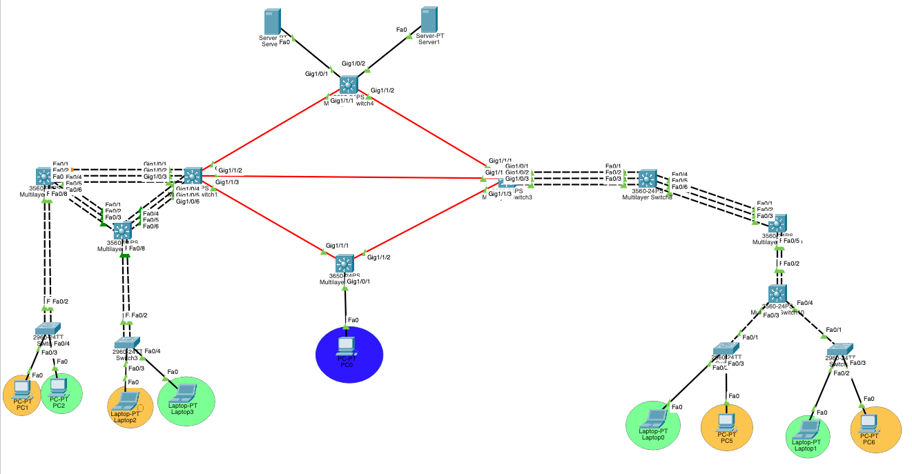

La red de Chapin Red conecta 4 edificios mediante switches multicapa 3650-24PS usando fibra óptica. El edificio izquierdo usa una arquitectura jerárquica con LACP y el edificio derecho usa PAgP en cadena. Un PC de administración se conecta al switch MAN_BOT con VLAN 99.

---

## Subnetting

### Red de VLANs: 192.188.95.0/24 (FLSM /27)

Se dividió en 5 subredes iguales de 30 hosts utilizables cada una.

| VLAN | Nombre | Red | Gateway | Rango | Broadcast |
|---|---|---|---|---|---|
| 10 | Naranja IZQ | 192.188.95.0/27 | .1 | .2 – .30 | .31 |
| 20 | Verde IZQ | 192.188.95.32/27 | .33 | .34 – .62 | .63 |
| 30 | Naranja DER | 192.188.95.64/27 | .65 | .66 – .94 | .95 |
| 40 | Verde DER | 192.188.95.96/27 | .97 | .98 – .126 | .127 |
| 99 | ADMIN | 192.188.95.128/27 | .129 | .130 – .158 | .159 |

### Red de enlaces: 10.4.95.0/24 (VLSM /30)

Se usaron subredes /30 para los enlaces punto a punto de fibra óptica entre los switches MAN, y también para conectar los servidores DHCP.

| Enlace | Red | IP extremo A | IP extremo B |
|---|---|---|---|
| MAN_TOP ↔ MAN_IZQ | 10.4.95.0/30 | .1 | .2 |
| MAN_TOP ↔ MAN_DER | 10.4.95.4/30 | .5 | .6 |
| MAN_IZQ ↔ MAN_DER | 10.4.95.8/30 | .9 | .10 |
| MAN_IZQ ↔ MAN_BOT | 10.4.95.12/30 | .13 | .14 |
| MAN_DER ↔ MAN_BOT | 10.4.95.16/30 | .17 | .18 |
| MAN_TOP ↔ DHCP1 | 10.4.95.20/30 | .21 | .22 |
| MAN_TOP ↔ DHCP2 | 10.4.95.24/30 | .25 | .26 |

---

## VLANs y VTP

Se definieron 5 VLANs con la nomenclatura solicitada:

| ID | Nombre completo |
|---|---|
| 10 | VLAN_Naranja_EdificioIZQ_202201395 |
| 20 | VLAN_Verde_EdificioIZQ_202201395 |
| 30 | VLAN_Naranja_EdificioDER_202201395 |
| 40 | VLAN_Verde_EdificioDER_202201395 |
| 99 | VLAN_ADMIN_202201395 |

**Configuración VTP:**
- Dominio: `CHAPINRED95`
- Contraseña: `chapin95`
- MAN_TOP, MAN_IZQ, MAN_DER, MAN_BOT → VTP Server (porque los enlaces de fibra entre ellos son L3 y VTP solo se propaga por trunks L2)
- IZQ_CORE1, IZQ_DIST, IZQ_ACC1, IZQ_ACC2, DER_TOP, DER_MID, DER_LOW, DER_ACC1, DER_ACC2 → VTP Client

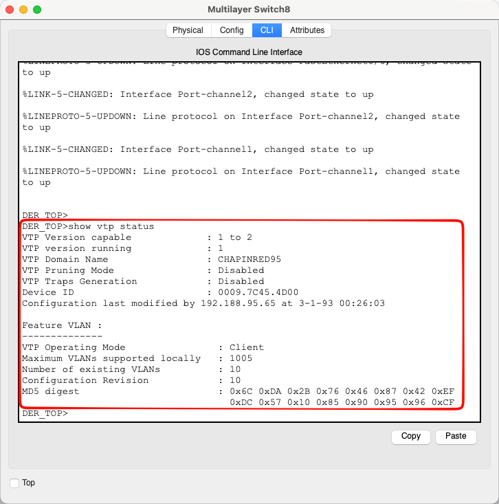

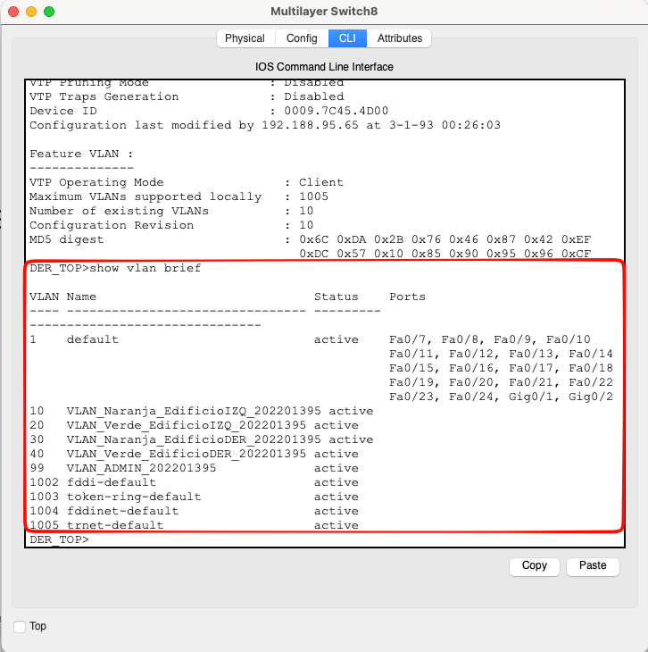

---

## Configuración DHCP

Se implementaron dos servidores DHCP conectados a MAN_TOP por interfaces L3 (no access VLAN). Cada servidor tiene pools para las VLANs de su edificio.

**DHCP1** (IP: 10.4.95.22, gateway: 10.4.95.21):

| Pool | Gateway | Start IP | Máscara |
|---|---|---|---|
| VLAN10_NARANJA_IZQ | 192.188.95.1 | 192.188.95.4 | 255.255.255.224 |
| VLAN20_VERDE_IZQ | 192.188.95.33 | 192.188.95.35 | 255.255.255.224 |

**DHCP2** (IP: 10.4.95.26, gateway: 10.4.95.25):

| Pool | Gateway | Start IP | Máscara |
|---|---|---|---|
| VLAN30_NARANJA_DER | 192.188.95.65 | 192.188.95.68 | 255.255.255.224 |
| VLAN40_VERDE_DER | 192.188.95.97 | 192.188.95.99 | 255.255.255.224 |

**DHCP Relay** configurado con `ip helper-address` en las SVIs de MAN_IZQ y MAN_DER apuntando a las IPs de los servidores.

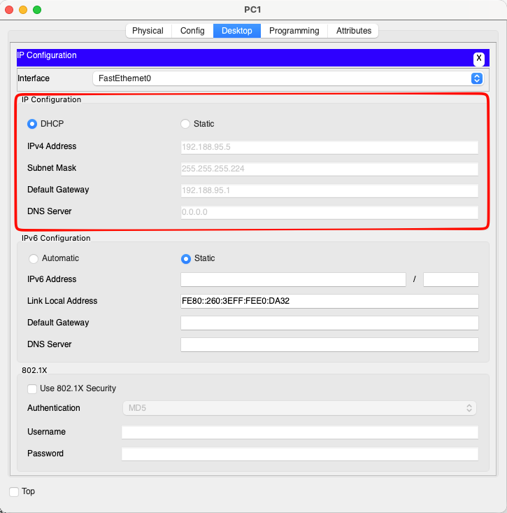

---

## EtherChannel

### Edificio Izquierdo — LACP (5 Port-Channels)

MAN_IZQ (3650) participa directamente en el triángulo LACP junto con IZQ_CORE1 e IZQ_DIST.

| Port-Channel | Dispositivos | Cables | Protocolo |
|---|---|---|---|
| Po1 | IZQ_CORE1 ↔ MAN_IZQ | 3 | LACP (active) |
| Po2 | IZQ_CORE1 ↔ IZQ_DIST | 3 | LACP (active) |
| Po3 | MAN_IZQ ↔ IZQ_DIST | 3 | LACP (active) |
| Po4 | IZQ_CORE1 ↔ IZQ_ACC1 | 2 | LACP (active) |
| Po5 | IZQ_DIST ↔ IZQ_ACC2 | 2 | LACP (active) |

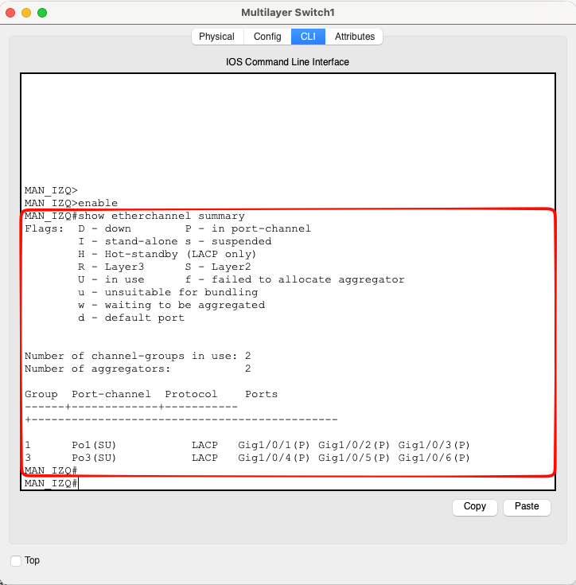

### Edificio Derecho — PAgP (3 Port-Channels)

MAN_DER (3650) conecta en cadena por PAgP hacia DER_TOP, DER_MID y DER_LOW.

| Port-Channel | Dispositivos | Cables | Protocolo |
|---|---|---|---|
| Po1 | MAN_DER ↔ DER_TOP | 3 | PAgP (desirable) |
| Po2 | DER_TOP ↔ DER_MID | 3 | PAgP (desirable) |
| Po3 | DER_MID ↔ DER_LOW | 2 | PAgP (desirable) |

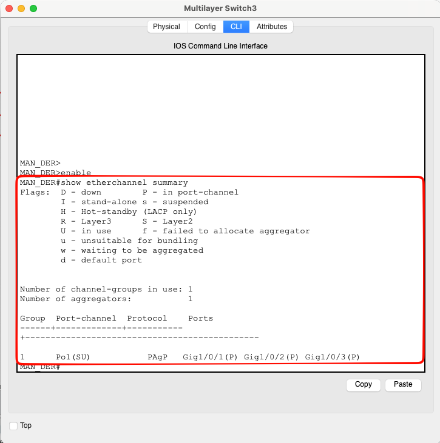

---

## Enrutamiento Dinámico — EIGRP (AS 95)

Carné 202201395 termina en 5 (impar), entonces se usó EIGRP. Se configuró en los 4 switches MAN con `no auto-summary`.

Las redes anunciadas en cada switch:

| Switch | Redes anunciadas |
|---|---|
| MAN_TOP | 10.4.95.0/30, 10.4.95.4/30, 10.4.95.20/30, 10.4.95.24/30 |
| MAN_IZQ | 10.4.95.0/30, 10.4.95.8/30, 10.4.95.12/30, 192.188.95.0/27, 192.188.95.32/27 |
| MAN_DER | 10.4.95.4/30, 10.4.95.8/30, 10.4.95.16/30, 192.188.95.64/27, 192.188.95.96/27 |
| MAN_BOT | 10.4.95.12/30, 10.4.95.16/30, 192.188.95.128/27 |

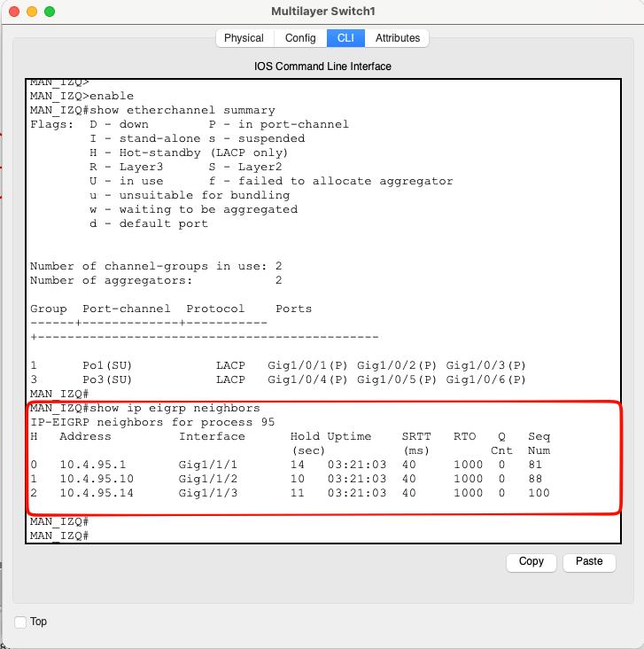

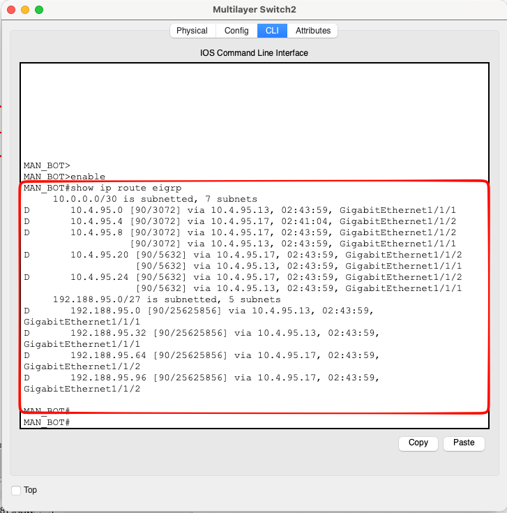

---

## ACLs — Restricciones de comunicación

Se implementaron ACLs extendidas para controlar el tráfico entre VLANs según las políticas del enunciado.

### Políticas implementadas

| Origen | Destino | Acción |
|---|---|---|
| Naranja (V10/V30) | Naranja (V10/V30) | Permitido |
| Verde (V20/V40) | Verde (V20/V40) | Permitido |
| Naranja | Verde | Bloqueado |
| Verde | Naranja | Bloqueado |
| ADMIN (V99) | Todas las VLANs | Permitido |
| Cualquier VLAN | ADMIN (V99) | Bloqueado |

### Ubicación de las ACLs

- **MAN_IZQ:** ACL_VLAN10_NARANJA (in VLAN 10), ACL_VLAN20_VERDE (in VLAN 20)
- **MAN_DER:** ACL_VLAN30_NARANJA (in VLAN 30), ACL_VLAN40_VERDE (in VLAN 40)
- **MAN_BOT:** ACL_ADMIN_OUT (in VLAN 99), ACL_ADMIN_IN (out VLAN 99)

La ACL de ADMIN usa `permit icmp echo-reply` y `permit tcp established` en dirección out para permitir las respuestas de tráfico que ADMIN inició, pero bloquear tráfico que otras VLANs intenten iniciar hacia ADMIN.

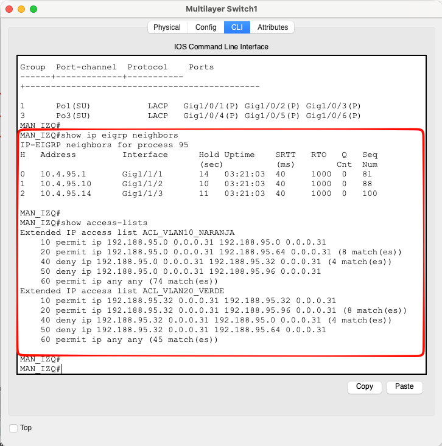

---

## Pruebas de conectividad

### Comunicación entre VLANs

| # | Origen | Destino | Esperado | Resultado |
|---|---|---|---|---|
| 1 | PC0 (V10 Naranja IZQ) | PC2 (V30 Naranja DER) | Exitoso | 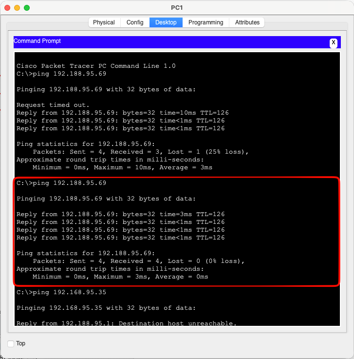 |
| 2 | Laptop0 (V20 Verde IZQ) | Laptop2 (V40 Verde DER) | Exitoso | 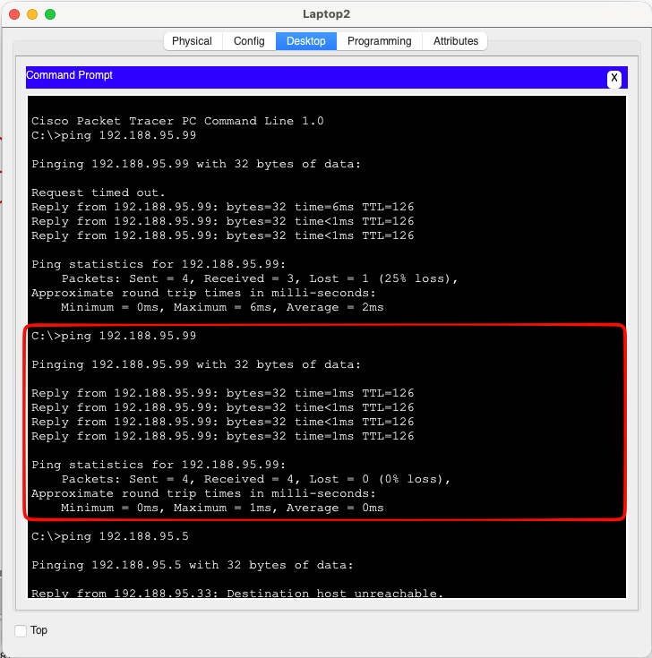 |
| 3 | PC0 (V10 Naranja) | Laptop0 (V20 Verde) | Bloqueado | 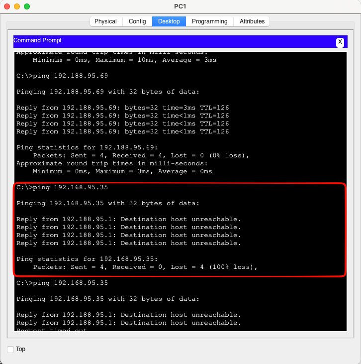 |
| 4 | Laptop0 (V20 Verde) | PC0 (V10 Naranja) | Bloqueado | 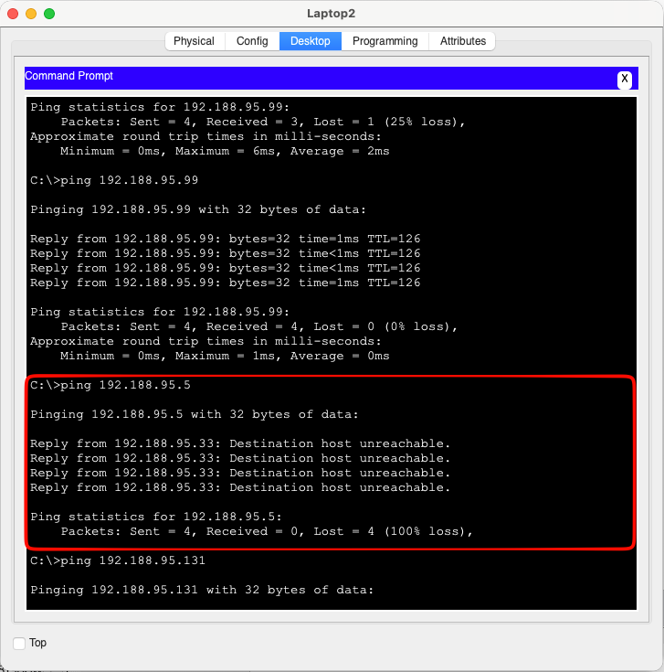 |
| 5 | PC_ADMIN (V99) | PC0 (V10 Naranja) | Exitoso | 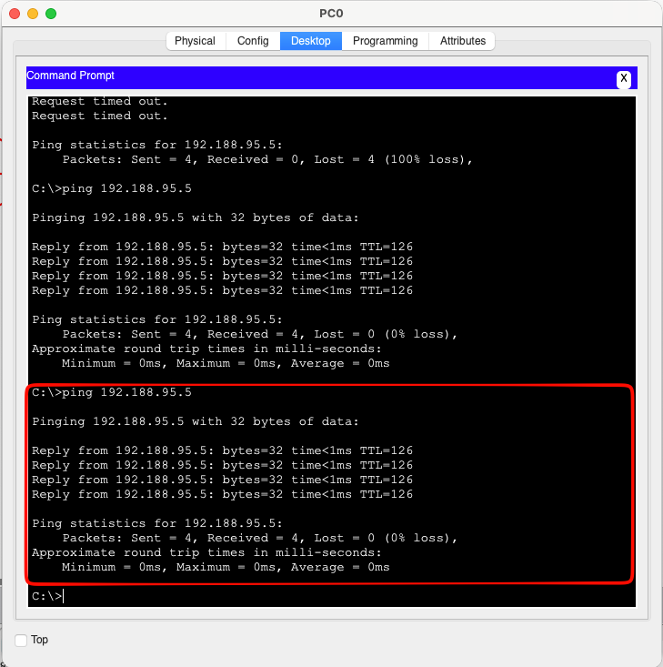 |
| 6 | PC_ADMIN (V99) | Laptop2 (V40 Verde) | Exitoso | 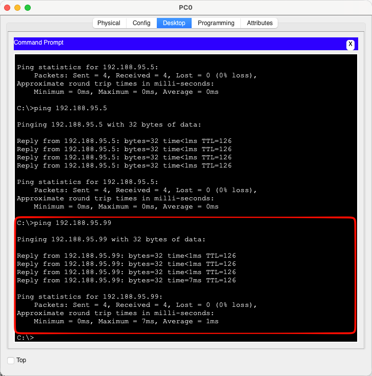 |
| 7 | PC0 (V10 Naranja) | PC_ADMIN (V99) | Bloqueado | 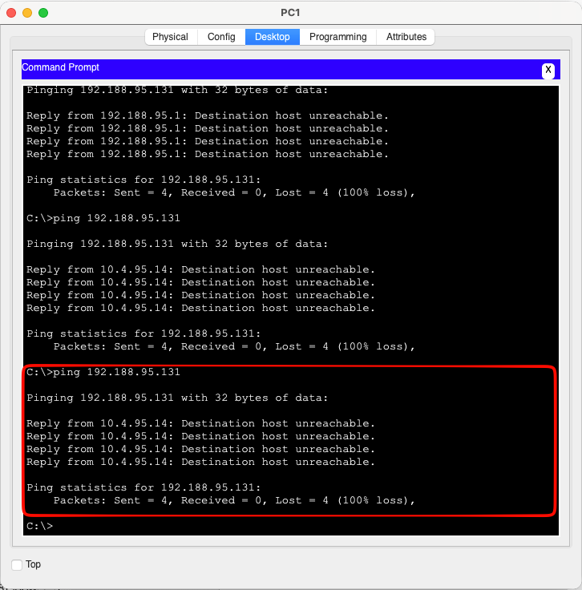 |
| 8 | Laptop0 (V20 Verde) | PC_ADMIN (V99) | Bloqueado | 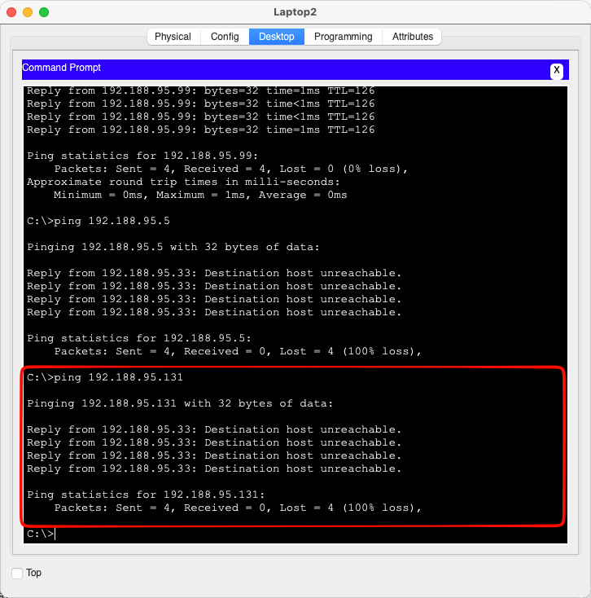 |

### Tolerancia a fallos LACP

1. Ping continuo entre PC0 y PC1
2. Se deshabilitó un puerto del Port-Channel (ej: `shutdown` en Fa0/1 de IZQ_CORE1)
3. El ping no se interrumpió

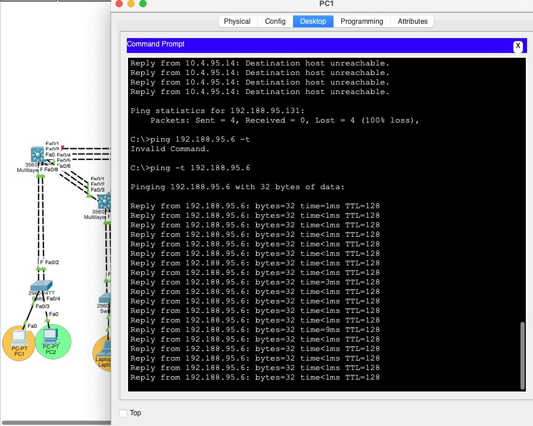

### Tolerancia a fallos PAgP

1. Ping continuo entre PC2 y PC3
2. Se deshabilitó un puerto del Port-Channel en el edificio derecho
3. El ping no se interrumpió

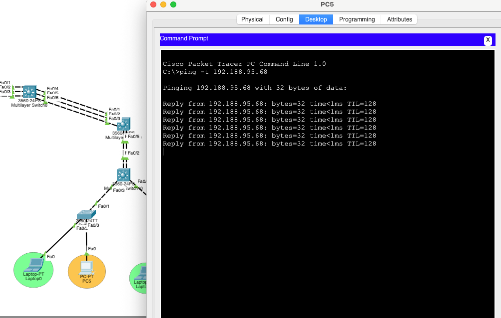

---

## Comandos principales utilizados

### VTP
```
vtp domain CHAPINRED95
vtp password chapin95
vtp mode server
vtp mode client
```

### VLANs
```
vlan 10
name VLAN_Naranja_EdificioIZQ_202201395
```

### EtherChannel LACP
```
interface range FastEthernet0/1-3
channel-group 1 mode active
```

### EtherChannel PAgP
```
interface range GigabitEthernet1/0/1-3
channel-group 1 mode desirable
```

### Trunk
```
switchport trunk encapsulation dot1q
switchport mode trunk
switchport trunk allowed vlan 10,20,30,40,99
```

### Interfaces L3 (fibra)
```
interface GigabitEthernet1/1/1
no switchport
ip address 10.4.95.1 255.255.255.252
```

### SVIs
```
interface Vlan 10
ip address 192.188.95.1 255.255.255.224
```

### EIGRP
```
router eigrp 95
network 10.4.95.0 0.0.0.3
network 192.188.95.0 0.0.0.31
no auto-summary
```

### DHCP Relay
```
interface Vlan 10
ip helper-address 10.4.95.22
```

### ACLs
```
ip access-list extended ACL_VLAN10_NARANJA
permit ip 192.188.95.0 0.0.0.31 192.188.95.0 0.0.0.31
permit ip 192.188.95.0 0.0.0.31 192.188.95.64 0.0.0.31
deny ip 192.188.95.0 0.0.0.31 192.188.95.32 0.0.0.31
deny ip 192.188.95.0 0.0.0.31 192.188.95.96 0.0.0.31
permit ip any any

interface Vlan 10
ip access-group ACL_VLAN10_NARANJA in
```

### STP
```
spanning-tree mode pvst
```